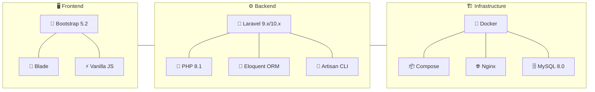

```markdown
# 🛍️ Каталог интернет-магазина на Laravel + Docker

Простой, но функциональный каталог товаров, разработанный как тестовое задание. Позволяет просматривать группы товаров и сами товары с возможностью сортировки и пагинации.

## 🌟 Обзор

-   Просмотр иерархии групп товаров (с подсчетом товаров).
-   Сворачиваемые/разворачиваемые группы для удобной навигации.
-   Отображение товаров на главной странице (все) или в выбранной группе (включая подгруппы).
-   Сортировка товаров по цене и названию (возрастание/убывание).
-   Пагинация товаров (по 6 на странице).
-   Просмотр детальной карточки товара с ценой и "хлебными крошками".
-   Адаптивный дизайн с использованием Bootstrap 5.
-   Легкий запуск и развертывание с помощью Docker Compose.

```mermaid
graph TD
    A[👤 Пользователь] -->|Открывает| B(🌐 Веб-приложение)
    B -->|Видит| C[📂 Список корневых групп <br> (с кол-вом товаров)]
    B -->|Видит| D[📦 Список всех товаров <br> (с пагинацией)]
    C -- Нажимает --> E{Развернуть/Перейти <br> в группу}
    E -- Развернуть --> C
    E -- Перейти --> F[📄 Страница группы]
    F -->|Видит| G[📁 Подгруппы]
    F -->|Видит| H[🍞 Хлебные крошки]
    F -->|Видит| I[📦 Товары группы <br> (с пагинацией)]
    D & I -->|Использует| J[🔄 Сортировка <br> (Цена/Название)]
    D & I -->|Использует| K[🔢 Пагинация]
    D & I -- Нажимает --> L[🛒 Карточка товара]
    L -->|Видит| M[📝 Название]
    L -->|Видит| N[💰 Цена]
    L -->|Видит| H
```

## ⚙️ Стек технологий




## 📊 Структура базы данных

Проект использует три основные таблицы (`test.sql`):

1.  **groups**: Иерархия групп товаров.
    -   `id` (PK): Идентификатор группы
    -   `id_parent`: ID родительской группы (0 для корневых)
    -   `name`: Название группы
2.  **products**: Товары.
    -   `id` (PK): Идентификатор товара
    -   `id_group` (FK -> groups.id): ID группы, к которой принадлежит товар
    -   `name`: Название товара
3.  **prices**: Цены товаров.
    -   `id` (PK): Идентификатор записи цены
    -   `id_product` (FK -> products.id): ID товара
    -   `price`: Цена товара (double)

## 💻 Установка и запуск

### 🔧 Предварительные требования

-   [Git](https://git-scm.com/)
-   [Docker](https://www.docker.com/products/docker-desktop/) (включая Docker Compose)

### 🚀 Шаги установки

1.  **Клонируйте репозиторий:**
    ```bash
    git clone https://github.com/SubbotinRoman/shop-catalog.git
    ```
    *(Замените `shop-catalog` на актуальное имя вашего репозитория, если оно другое)*

2.  **Перейдите в директорию проекта:**
    ```bash
    cd shop-catalog
    ```

3.  **Проверка файла `.env`:**
    *   Этот репозиторий **включает** предварительно настроенный файл `.env` для упрощения запуска в Docker-окружении. Убедитесь, что он присутствует в корневой папке после клонирования.
    *   *Примечание для безопасности:* В реальных проектах файл `.env` **не должен** включаться в систему контроля версий.

4.  **Соберите и запустите Docker-контейнеры:**
    *   Эта команда скачает/соберет образы и запустит контейнеры `app` (PHP), `web` (Nginx) и `db` (MySQL) в фоновом режиме.
        ```bash
        docker compose up -d --build
        ```
    *   *(При последующих запусках достаточно `docker compose up -d`)*

5.  **Установите зависимости Composer:**
    *   Выполняем внутри контейнера `app`.
        ```bash
        docker compose exec app composer install
        ```

6.  **Проверьте/Сгенерируйте ключ приложения Laravel:**
    *   Скорее всего, рабочий ключ `APP_KEY` уже указан в файле `.env`, включенном в репозиторий. Если по какой-то причине приложение выдает ошибку об отсутствии ключа, выполните команду:
        ```bash
        docker compose exec app php artisan key:generate
        ```

7.  **Очистите кеш конфигурации (рекомендуется):**
    ```bash
    docker compose exec app php artisan config:clear
    ```

8.  **Импортируйте дамп базы данных:**
    *   Убедитесь, что файл `test.sql` находится в корне проекта.
    *   Эта команда выполнит SQL-скрипт из файла в базе данных `shop` контейнера `db`.
        ```bash
        docker compose exec -T db mysql -uuser -psecret shop < test.sql
        ```
    *   *(Используются учетные данные `user`/`secret` и база `shop`, заданные в `docker-compose.yml` и `.env`)*

### ✅ Проверка

-   Откройте ваш веб-браузер и перейдите по адресу: [http://localhost](http://localhost)
-   Вы должны увидеть главную страницу каталога с группами слева и товарами справа.

### 🛠️ Основные команды Docker Compose

-   **Запустить контейнеры (в фоне):**
    ```bash
    docker compose up -d
    ```
-   **Остановить контейнеры:**
    ```bash
    docker compose down
    ```
-   **Посмотреть логи (например, контейнера app):**
    ```bash
    docker compose logs -f app
    ```
-   **Выполнить команду внутри контейнера (например, `php artisan`):**
    ```bash
    docker compose exec app php artisan <ваша_команда>
    ```
-   **Пересобрать образы (если меняли Dockerfile):**
    ```bash
    docker compose build
    ```
-   **Остановить и удалить контейнеры, сети, тома (осторожно, удалит данные БД!):**
    ```bash
    docker compose down -v
    ```

## 🏗️ Архитектура и Реализация (Кратко)

-   **Структура:** Стандартная структура Laravel (MVC).
-   **Маршрутизация:** Определена в `routes/web.php`. Используется Route Model Binding для групп и товаров.
-   **Контроллер:** `CatalogController` обрабатывает все запросы, получает данные из моделей и передает их в представления.
-   **Модели:** `Group`, `Product`, `Price` с настроенными отношениями Eloquent (`belongsTo`, `hasMany`, `hasOne`) и вспомогательными методами (`getTotalProductCount`, `getAllChildrenIds`, `getBreadcrumbs`). Использован `withCount` для оптимизации запроса количества дочерних групп.
-   **Представления:** Шаблоны Blade (`resources/views/catalog/`). Используется основной макет `layouts/app.blade.php`, частичные шаблоны (`partials/`) для групп, товаров, хлебных крошек. Bootstrap 5 используется для разметки и стилизации.
-   **База данных:** Используется MySQL. Данные инициализируются импортом из `test.sql`.
-   **Сессии:** Настроены на использование файлового драйвера (`SESSION_DRIVER=file` в `.env`).
-   **Категории:** Реализовано сворачивание/разворачивание дерева категорий с помощью Bootstrap Collapse и небольшого ванильного JavaScript для смены иконок.

## 🤔 Принятые решения и допущения

-   **Источник данных:** Данные импортируются из предоставленного `test.sql`. Миграции и сидеры Laravel не использовались для начальной загрузки, но могут быть добавлены.
-   **Кодировка БД:** Файл `test.sql` был скорректирован для использования `utf8mb4` во избежание проблем с длиной строк.
-   **Одна цена:** Предполагается, что у товара есть только одна актуальная цена, указанная в таблице `prices`.
-   **Сессии:** Используется файловый драйвер сессий для простоты.
-   **Оптимизация:** Для подсчета количества товаров в группах используется рекурсивный метод в модели `Group`. Для отображения кнопки +/- используется `withCount('children')`. В сложных сценариях с очень глубокой вложенностью или большим количеством товаров могут потребоваться дополнительные оптимизации (кеширование, денормализация).
-   **Фреймворк Frontend:** Bootstrap 5 подключен через CDN.
-   **Файл `.env`:** Включен в репозиторий для упрощения процедуры запуска тестового задания. В реальных проектах этот файл должен быть исключен из Git.
```
