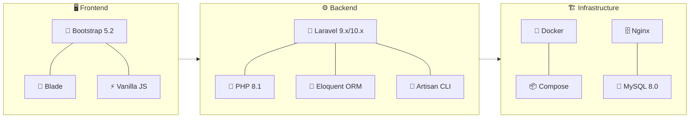

# 🛍️ Каталог интернет-магазина на Laravel + Docker

Простой, но функциональный каталог товаров, разработанный как тестовое задание. Позволяет просматривать группы товаров и сами товары с возможностью сортировки и пагинации.

## 🌟 Обзор

-   Просмотр иерархии групп товаров (с подсчетом товаров).
-   Сворачиваемые/разворачиваемые группы для удобной навигации.
-   Отображение товаров на главной странице (все) или в выбранной группе (включая подгруппы).
-   Сортировка товаров по цене и названию (возрастание/убывание).
-   Пагинация товаров (по 6 на странице).
-   Просмотр детальной карточки товара с ценой и "хлебными крошками".
-   Адаптивный дизайн с использованием Bootstrap 5.
-   Легкий запуск и развертывание с помощью Docker Compose.

```mermaid
graph TD
    A[👤 Пользователь] -->|Открывает| B(🌐 Веб-приложение)
    B -->|Видит| C[📂 Список корневых групп <br> (с кол-вом товаров)]
    B -->|Видит| D[📦 Список всех товаров <br> (с пагинацией)]
    C -- Нажимает --> E{Развернуть/Перейти <br> в группу}
    E -- Развернуть --> C
    E -- Перейти --> F[📄 Страница группы]
    F -->|Видит| G[📁 Подгруппы]
    F -->|Видит| H[🍞 Хлебные крошки]
    F -->|Видит| I[📦 Товары группы <br> (с пагинацией)]
    D & I -->|Использует| J[🔄 Сортировка <br> (Цена/Название)]
    D & I -->|Использует| K[🔢 Пагинация]
    D & I -- Нажимает --> L[🛒 Карточка товара]
    L -->|Видит| M[📝 Название]
    L -->|Видит| N[💰 Цена]
    L -->|Видит| H
```

## ⚙️ Стек технологий




## 💻 Быстрый запуск

### 🔧 Требования

-   [Docker](https://www.docker.com/products/docker-desktop/) и Docker Compose
-   [Git](https://git-scm.com/) (для клонирования репозитория)

### 🚀 Установка и запуск в 6 шагов

1. **Клонируйте репозиторий:**

    ```bash
    git clone https://github.com/SubbotinRoman/shop.git
    ```

2. **Перейдите в директорию проекта:**

    ```bash
    cd shop
    ```

3. **Запустите контейнеры:**

    ```bash
    docker compose up -d
    ```

4. **Установите зависимости:**

    ```bash
    docker compose exec app composer install
    ```

5. **Импортируйте тестовые данные:**

    ```bash
    docker compose exec db mysql -u root -psecret -e "DROP DATABASE shop; CREATE DATABASE shop CHARACTER SET utf8mb4 COLLATE utf8mb4_unicode_ci;"
    docker compose exec -T db mysql -u user -psecret --default-character-set=utf8mb4 shop < test.sql

    ```
    
6. **Откройте проект в браузере:** [http://localhost](http://localhost)

### 🛠️ Дополнительные команды

-   **Остановка контейнеров:**

    ```bash
    docker compose down
    ```

-   **Просмотр логов:**

    ```bash
    docker compose logs -f app
    ```

-   **Выполнение команд Artisan:**
    ```bash
    docker compose exec app php artisan <команда>
    ```

## 🏗️ Структура проекта

```
shop/
├── app/                      # Основной код приложения
│   ├── Http/                 # HTTP-обработчики
│   │   ├── Controllers/      # Контроллеры
│   ├── Models/               # Модели Eloquent
├── public/                   # Публичные ресурсы
├── resources/                # Views и ресурсы фронтенда
│   ├── views/                # Blade-шаблоны
├── routes/                   # Маршруты приложения
├── database/                 # Миграции и сиды
├── docker/                   # Конфигурация Docker
│   ├── nginx/                # Настройки Nginx
│   ├── php/                  # Dockerfile и настройки PHP
├── docker-compose.yml        # Конфигурация Docker Compose
├── README.md                 # Документация проекта
├── .env                      # Переменные окружения
└── test.sql                  # SQL-дамп тестовых данных
```

## 📊 Структура базы данных

Проект использует три основные таблицы (`test.sql`):

1.  **groups**: Иерархия групп товаров.
    -   `id` (PK): Идентификатор группы
    -   `id_parent`: ID родительской группы (0 для корневых)
    -   `name`: Название группы
2.  **products**: Товары.
    -   `id` (PK): Идентификатор товара
    -   `id_group` (FK -> groups.id): ID группы, к которой принадлежит товар
    -   `name`: Название товара
3.  **prices**: Цены товаров.
    -   `id` (PK): Идентификатор записи цены
    -   `id_product` (FK -> products.id): ID товара
    -   `price`: Цена товара (double)

## 🤔 Принятые решения и допущения

-   **Источник данных:** Данные импортируются из предоставленного `test.sql`. Миграции и сидеры Laravel не использовались для начальной загрузки.
-   **Кодировка БД:** Файл `test.sql` был скорректирован для использования `utf8mb4` во избежание проблем с длиной строк.
-   **Оптимизация:** Для подсчета количества товаров в группах используется рекурсивный метод в модели `Group`. Для отображения кнопки +/- используется `withCount('children')`. В сложных сценариях с очень глубокой вложенностью или большим количеством товаров могут потребоваться дополнительные оптимизации (кеширование, денормализация).
-   **Фреймворк Frontend:** Bootstrap 5 подключен через CDN.
-   **Файл `.env`:** Включен в репозиторий для упрощения процедуры запуска тестового задания. В реальных проектах этот файл должен быть исключен из Git.

## 📚 Примечания

-   **Файл `.env`:** Включен в репозиторий для упрощения запуска тестового задания. В реальных проектах этот файл не следует включать в систему контроля версий.
