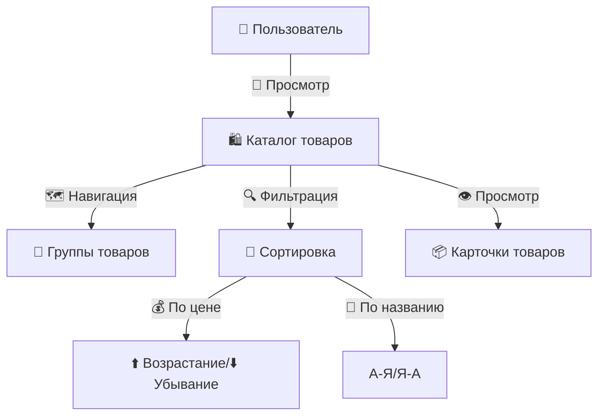
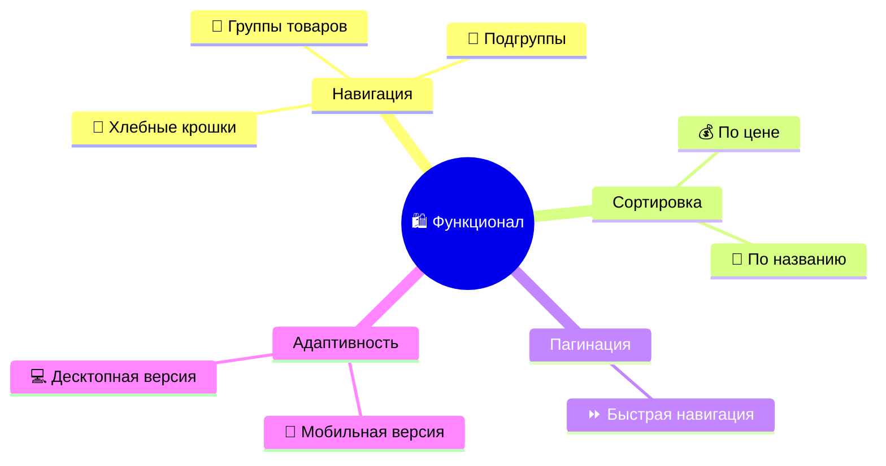

# 🛍️ Каталог интернет-магазина

## 🌟 Обзор

Современный каталог товаров 🛍️ с возможностью:

- 🔄 сортировки
- 📄 пагинации
- 🔍 фильтрации по группам

Обеспечивает:

- 👀 удобный просмотр товаров
- 🗺️ навигацию по категориям
- 📱 адаптивный дизайн
- ⚡ быструю работу



## ⚙️ Стек технологий


## 🚀 Возможности


- 📋 Вывод списка групп товаров первого уровня
- 🔍 Просмотр товаров в выбранной группе и подгруппах
- 🔄 Сортировка товаров:
  - По цене (возрастание/убывание)
  - По названию (возрастание/убывание)
- 📱 Адаптивный дизайн с использованием Bootstrap
- 📊 Пагинация товаров
- 🍞 Хлебные крошки для навигации
- 🛒 Карточки товаров с подробной информацией

## 📊 Структура базы данных

Проект использует три основные таблицы:

1. **groups** - группы товаров:

   - `id` - идентификатор группы
   - `id_parent` - идентификатор родительской группы
   - `name` - название группы

2. **products** - товары:

   - `id` - идентификатор товара
   - `id_group` - идентификатор группы
   - `name` - название товара

3. **prices** - цены товаров:
   - `id` - идентификатор записи
   - `id_product` - идентификатор товара
   - `price` - цена товара

## 💻 Быстрый запуск

### 🔧 Требования

-   🐳 [Docker](https://www.docker.com/products/docker-desktop/) 
-   📦 [Git](https://git-scm.com/) 

### 🚀 Установка и запуск

1. **Клонируйте репозиторий:**

    ```bash
    git clone https://github.com/SubbotinRoman/shop.git
    ```

2. **Перейдите в директорию проекта:**

    ```bash
    cd shop
    ```

3. **Запустите контейнеры:**

    ```bash
    docker compose up -d
    ```

4. **Установите зависимости:**

    ```bash
    docker compose exec app composer install
    ```

5. **Импортируйте данные:**

    ```bash
    docker compose exec db mysql -u root -psecret -e "DROP DATABASE shop; CREATE DATABASE shop CHARACTER SET utf8mb4 COLLATE utf8mb4_unicode_ci;"
    docker compose exec -T db mysql -u user -psecret --default-character-set=utf8mb4 shop < test.sql

    ```
    
6. **Откройте проект в браузере:** 🌐 [http://localhost](http://localhost)

### 🛠️ Дополнительные команды

-   **Остановка контейнеров:**

    ```bash
    docker compose down
    ```

## 🏗️ Структура проекта

```
shop/
├── app/                      # Основной код приложения
│   ├── Http/                 # HTTP-обработчики
│   │   ├── Controllers/      # Контроллеры
│   ├── Models/               # Модели Eloquent
├── public/                   # Публичные ресурсы
├── resources/                # Views и ресурсы фронтенда
│   ├── views/                # Blade-шаблоны
├── routes/                   # Маршруты приложения
├── database/                 # Миграции и сиды
├── docker/                   # Конфигурация Docker
│   ├── nginx/                # Настройки Nginx
│   ├── php/                  # Dockerfile и настройки PHP
├── docker-compose.yml        # Конфигурация Docker Compose
├── README.md                 # Документация проекта
├── .env                      # Переменные окружения
└── test.sql                  # SQL-дамп тестовых данных
```

## 🤔 Принятые решения и допущения

-   **Источник данных:** Данные импортируются из предоставленного `test.sql`. Миграции и сидеры Laravel не использовались для начальной загрузки.
-   **Кодировка БД:** Файл `test.sql` был скорректирован для использования `utf8mb4` во избежание проблем с длиной строк.
-   **Фреймворк Frontend:** Bootstrap 5 подключен через CDN.
-   **Файл `.env`:** Включен в репозиторий для упрощения процедуры запуска тестового задания. В реальных проектах этот файл должен быть исключен из Git.


